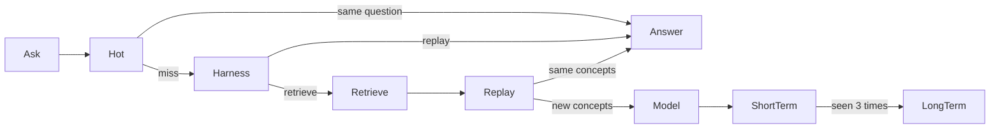
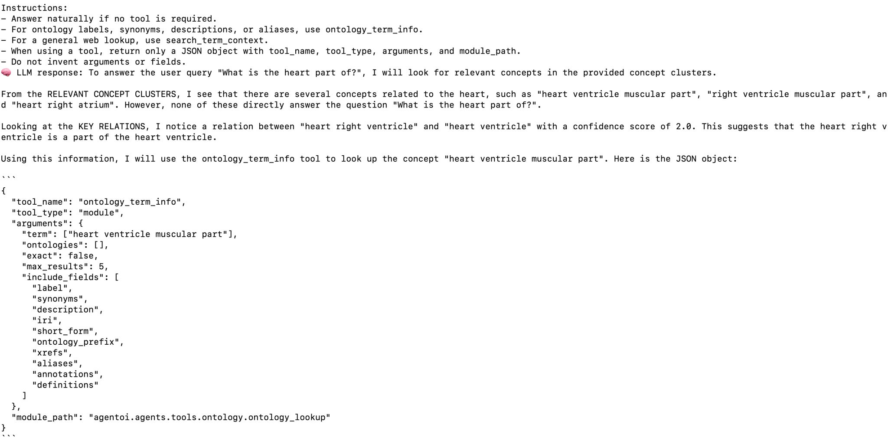

# MOIRA

MOIRA (Memory-Augmented Ontology Integration with Cost-Bounded Reasoning Agents)
is a Python toolkit for ontology integration, matching, refinement, and
ontology-grounded language-model reasoning. It combines RDF/OWL parsing, graph
and text embeddings, pluggable retrieval, validation, uncertainty
quantification, and Ontology-of-Thought traces.

[Documentation](https://lamng3.github.io/moira-docs/) ·
[Architecture](https://lamng3.github.io/moira-docs/architecture.html) ·
[API reference](https://lamng3.github.io/moira-docs/api.html) ·
[Experiments](https://lamng3.github.io/moira-docs/experiments.html)

[](https://creativecommons.org/licenses/by/4.0/)

## Quick start

MOIRA requires Python 3.12 and [uv](https://docs.astral.sh/uv/).

```bash
git clone https://github.com/lamng3/moira.git
cd moira
./setup.sh
source .venv/bin/activate
moira --help
```

## Use it from another program

Install the package from this repository. Python 3.12 is required.

```bash
pip install "moira @ git+https://github.com/lamng3/moira.git"
```

```python
from moira import OntologyWorkspace

workspace = OntologyWorkspace("ontology.owl")
print(workspace.summary.concepts)
print(workspace.ask("Which concepts describe the heart?", model="ollama:llama3.1"))
```

Install that same command again to pick up a later update. The version is `moira.__version__`.

Inspect an OWL, RDF/XML, Turtle, N-Triples, TriG, TriX, or JSON-LD file without
an LLM:

```bash
moira inspect data/my-ontology.owl
```

Search it locally with graph and text retrieval:

```bash
moira search data/my-ontology.owl "water quality measurement" --top-k 8
```

Ask one natural-language question:

```bash
moira query data/my-ontology.owl \
  "Which concepts describe freshwater temperature?"
```

Or load the ontology once and keep asking questions:

```bash
moira chat data/my-ontology.owl
```

`query` and `chat` require an LLM provider. Set `LLM_MODEL` and its API key in
`.env`, or use a local Ollama model:

```bash
LLM_MODEL=ollama:llama3.1 moira chat data/my-ontology.owl
```

The first `search`, `query`, or `chat` run may download the configured text
embedding model and embed every concept. That result is saved under
`results/memory` and reused the next time you open the same ontology.
`inspect` is lightweight and does not load a model.

```bash
moira memory clear data/my-ontology.owl
```

Pass `--no-save-memory` to keep the embeddings in the current process only.
Local Ollama models use the `langchain-ollama` package included in the install.

## Query cache

Embedding memory and the query cache are separate. Embeddings under `results/memory` let the next run skip encoding concepts. The query cache under `results/cache/<sha>/` lets a repeated question skip the model.



The same question hits `hot.json` before retrieval. After a miss, the Harness asks typed questions about the question the user typed and can replay a cached one before retrieval starts. It runs only when the hot cache already has questions. `same_intent` is a yes-or-no, `match` chooses a cached question or retrieve, and `closeness` scores Different, Related, or Same question. A failed call, or a choice that is not in the cache, continues into retrieval. The default call is SGLang `/v1/systemone` at `http://127.0.0.1:30000` (`MOIRA_HARNESS_URL`). An empty `MOIRA_HARNESS_URL` keeps the Ollama router, `ollama:phi3` (`MOIRA_ROUTER_MODEL`). The answer model stays the one selected in chat. Optional Jev routing still chooses among answer models inside the agent and stays separate from this step. A wording that is not replayed hits graph replay when retrieval returns the same concept ids, in any order. Replay reads the stored answer and its SPARQL pattern. It does not execute that pattern. A different concept set still calls the model, then the capture is written into the short-term trie. After the same set has been answered 3 times it is copied into `long_term.json`.

| Tier | File | Default cap | Eviction |
| --- | --- | --- | --- |
| Hot | `hot.json` | 32 questions | Least frequently used |
| Short-term | `short_term.json` | 512 trie nodes | Least frequently used |
| Long-term | `long_term.json` | 1024 patterns | Least frequently used |

`lfu` drops the least frequently read record, then the one touched longest ago. `lru` drops the record touched longest ago. `2q` drops a one-time record before a repeated one. Hot, short-term, and long-term follow `MOIRA_CACHE_EVICTION`, which defaults to `lfu`. A new policy is a class with `choose(entries)` registered under a name.

```bash
export MOIRA_CACHE_DIR=results/cache
export MOIRA_HOT_ENTRIES=32
export MOIRA_SHORT_TERM_NODES=512
export MOIRA_LONG_TERM_ENTRIES=1024
export MOIRA_CACHE_EVICTION=lfu
```

## Demo

Ask the adult mouse anatomy ontology what the heart belongs to:

```bash
LLM_MODEL=ollama:llama3.1 moira chat data/MouseHuman/mouse.owl
```

The ontology loads before the first question, and the answer comes back as plain sentences. Add `--log` to print the detailed run while it works, or type `log` after an answer.

[What is the heart part of?](examples/mouse-anatomy-chat.md)

[](examples/mouse-anatomy-chat.md)

## Jev decisions

Jev is optional. Install it once, then enable only the decisions you want:

```bash
uv sync --extra jev
export JEV_API_KEY=your_typesafe_api_key
```

Context selection, model routing, and tool-risk gating are separate. All three
stay off unless their environment variable is set to `jev`. Query text sent to
Jev leaves the process for TypeSafe. Tool arguments are redacted first.

### Context selection

```bash
export MOIRA_CONTEXT_HARNESS=jev
moira query data/my-ontology.owl "Which concepts describe freshwater?"
```

The default mode is shadow: Jev records its proposed selection, and the
answering model still receives the retrieved shortlist. Set
`MOIRA_CONTEXT_MODE=live` after calibrating `min_relevance`. A missing key or
provider error fails open to the original shortlist. Concept labels and any web
snippets included in the shortlist are sent to TypeSafe.

### Model routing

```bash
export MOIRA_MODEL_ROUTING=jev
export MOIRA_ROUTE_LOCAL=ollama:phi3
export MOIRA_ROUTE_CAREFUL=deepseek-ai/DeepSeek-R1-Distill-Llama-70B
moira query data/my-ontology.owl "Resolve the alignment conflict."
```

Routing asks Jev one choice question before the first model call, then uses
that model for the rest of the run.

| Route | Used for | Model variable |
| --- | --- | --- |
| `local` | Short lookups, extraction, and questions answerable from retrieved context | `MOIRA_ROUTE_LOCAL` (default `ollama:phi3`) |
| `standard` | Normal ontology question answering and relation lookup | `MOIRA_ROUTE_STANDARD` (default `LLM_MODEL`) |
| `careful` | Alignment disputes, conflicts, refinement, or multi-ontology reasoning | `MOIRA_ROUTE_CAREFUL` (default `LLM_MODEL`) |

If Jev is unavailable, routing fails open and the run keeps `LLM_MODEL`. The
choice, probabilities, confidence, and `fail_open` flag are stored on the
`model_route` trace step and on the `llm_invoke` step. Ontology-of-Thought
receives the same decision as `model.routed`.

### Tool-risk gating

```bash
export MOIRA_TOOL_GATE=jev
export MOIRA_TOOL_RISK_THRESHOLD=0.5
export MOIRA_GATED_TOOLS=search_term_context,search_knowledge_graph
```

After a tool call is parsed, Jev estimates whether that call is unsafe to run.
Only tools named in `MOIRA_GATED_TOOLS` are checked. The built-in policy
gates `search_term_context` and `search_knowledge_graph` because they send
ontology terms to external services. `ontology_term_info` is a lookup and is
left ungated.

A probability at or above the threshold returns a structured refusal and does
not call the tool. The `tool_execute` trace step is marked `blocked`, and
Ontology-of-Thought records `tool.blocked`. When the gate is enabled and Jev
cannot decide, gated tools fail closed. Leaving `MOIRA_TOOL_GATE` unset
preserves normal tool execution. Arguments sent to Jev pass through redaction;
the query and those redacted arguments still leave the process for TypeSafe.

## Agent runtime

`MOIRA_TRACE_STORE=duckdb` writes each thought graph to `results/traces/moira.duckdb`. Install that store with `moira[traces]`. DynamoDB is used when `DYNAMO_TABLE` is set.

## Experiments

Run the dependency-light smoke benchmark first:

```bash
./scripts/run_experiments.sh smoke
```

It compares baseline relation normalization with structural refinement and
reports precision, recall, and F1. Run it twice to verify identical metric
fingerprints:

```bash
./scripts/run_experiments.sh smoke
cat results/experiments/smoke/summary.md
```

Compare passthrough context with a shadow Jev selection locally, without a Jev
API key:

```bash
./scripts/run_experiments.sh context
```

To send metrics, comparison tables, charts, logs, and manifests to a hosted
dashboard without retaining local results:

```bash
uv sync --extra tracking
uv run wandb login
./scripts/run_experiments.sh smoke --tracker wandb
```

Set `WANDB_PROJECT` and optional `WANDB_ENTITY` to choose the destination.
Hosted runs use temporary local artifacts and remove them after upload. Add
`--keep-local` if both copies are required. Only enable hosted tracking for
ontology data that may be uploaded under your organization's privacy policy.

Each execution has an immutable directory under
`results/experiments/<suite>/runs/<experiment>/<run-id>/`. The suite directory
also contains a comparison-first `summary.md`, plot-ready `metrics.csv`, and
per-experiment detail reports. Quality charts are generated only when a suite
contains multiple experiment variants, where comparison is meaningful.

Maintained data-backed experiments are declarative suites. Preview commands:

```bash
# Required once for bundled benchmark data
git lfs install
git lfs pull

./scripts/run_experiments.sh quickstart --dry-run
./scripts/run_experiments.sh ablations --dry-run
```

Run a suite or one named ablation:

```bash
./scripts/run_experiments.sh quickstart
./scripts/run_experiments.sh ablations --select with-refinement
```

The direct Python interface is:

```bash
python -m experiments experiments/configs/ablations.json
```

With the default local tracker, generated logs, metrics, manifests, and reports
stay under ignored `results/`.
The manifest records the exact command, source revision, configuration hash,
and result hash. Catalog-based evaluations are available through
`moira run --help`.

## Python API

```python
from moira.parser import Parser
from moira.retrieval import create_vector_index, create_web_search

ontology = Parser("data/my-ontology.owl").to_ontology()
web = create_web_search("mediawiki")
index = create_vector_index("torch-exact", dimension=768)
```

Built-in web providers are `static`, `dataset`, `mediawiki`, and `google-cse`.
Custom ANN, DiskANN, vector-database, and web-search adapters can be registered
through the public retrieval interfaces.

For graph maintenance, use `OfflineGraphRefiner` for complete graphs and
`OnlineOntologyRefiner` for streamed updates. Both accept configuration W's
`concept_similar` predicate.

## Repository layout

```text
src/moira/   Installable library and CLI
examples/      Small integration examples
experiments/   Reproducible suites and runner
scripts/       Maintained shell entry points
tests/         Automated tests
data/          Ontologies and benchmark inputs
docs/          Documentation website source
results/       Generated artifacts; ignored
```

## Development

```bash
pytest -q
pre-commit run --all-files
```

## How to Cite

If you use MOIRA in your work, please cite:

```bibtex
@misc{nguyen_2026_moira,
    title={MOIRA: Memory-Augmented Ontology Integration with Cost-Bounded Reasoning Agents},
    author={Lam Nguyen and Ethan Frakes and Hanchao Ma and Ozan Dernek and Roger H. French and Yinghui Wu},
    year={2026},
    url={https://github.com/lamng3/moira},
}
```

## License

MOIRA is released under the [Creative Commons Attribution 4.0 International License](https://creativecommons.org/licenses/by/4.0/).
